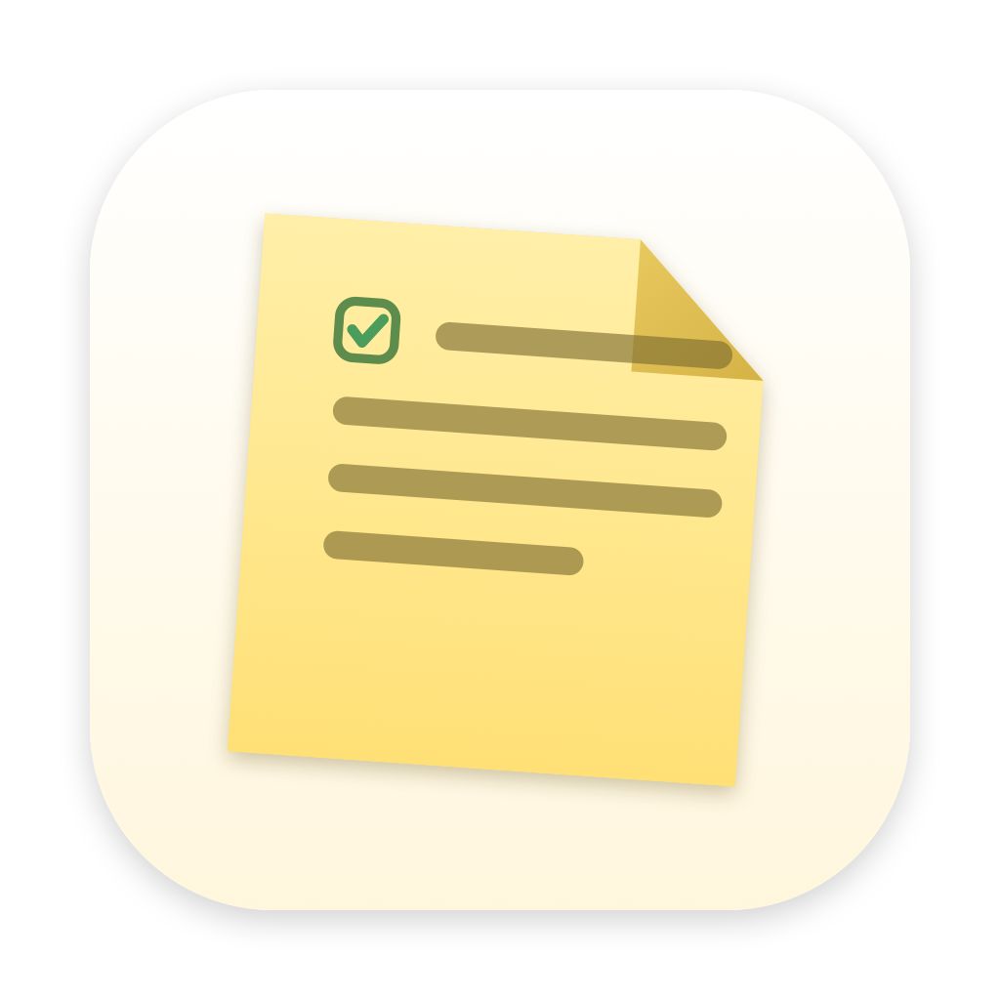
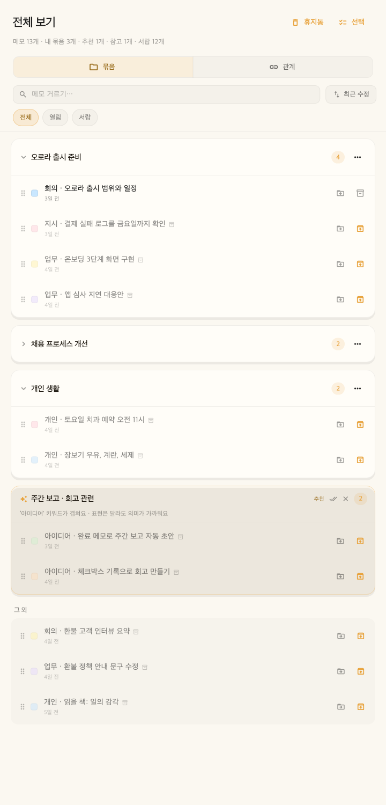

<div align="center">
  
  <h1>Noteez</h1>
  <p><strong>그냥 적으세요. 필요한 순간, Noteez가 다시 연결해 줍니다.</strong></p>
  <p>A local-first sticky-note workspace with quiet, on-device intelligence.</p>

  <p>
    
    
    
    
    <a href="https://github.com/hofe7/noteez/actions/workflows/ci.yml"></a>
  </p>
</div>

---

Noteez는 생각이 떠오를 때 바로 꺼내 쓰는 macOS 메뉴바 메모 앱입니다.

폴더와 태그를 먼저 정하지 않아도 됩니다. 회의 내용, 해야 할 일, 아이디어를
스티커에 가볍게 적어두면 키워드·작성 시점·메모 성격·온디바이스 의미 유사도를
함께 살펴 관련 메모와 묶음을 제안합니다. AI 모델이 없어도 메모, 검색, 그룹,
Markdown 이동성은 그대로 동작합니다.



## 다운로드 · 초기 베타

**[macOS용 Noteez 0.0.1 DMG 다운로드](https://github.com/hofe7/noteez/releases/download/v0.0.1/Noteez-0.0.1.dmg)**

Apple Silicon·Intel용 universal 빌드입니다. 현재 UI는 한국어이며, 초기 베타로 공개합니다.
Apple Developer ID 서명·공증은 아직 없어 첫 실행 시 macOS에서 수동 허용이 필요합니다.
설치 방법과 검증 범위는 [릴리스 안내](https://github.com/hofe7/noteez/releases/tag/v0.0.1)를 확인해 주세요.
문제나 사용 의견은 [Issues](https://github.com/hofe7/noteez/issues)에 남겨 주세요.
개인 메모·DB·백업 파일은 첨부하지 말고 가상 예제로 재현해 주세요.

## 왜 Noteez인가요?

대부분의 노트 앱은 정보를 잘 정리하려면 사용자가 먼저 구조를 만들어야 합니다.
Noteez는 반대로 접근합니다.

- **캡처가 먼저입니다.** 메뉴바나 전역 단축키로 즉시 적고 원래 하던 일로 돌아갑니다.
- **정리는 강요하지 않습니다.** AI는 메모를 멋대로 이동하지 않고, 근거와 함께 연결을 제안합니다.
- **모델이 없어도 유용합니다.** 키워드·시간·메모 종류를 조합한 하이브리드 추천이 기본으로 동작합니다.
- **메모는 내 Mac에 남습니다.** 계정도, Noteez 서버도, 메모 업로드도 없습니다.
- **언제든 나갈 수 있습니다.** 표준 Markdown과 이미지로 전체 데이터를 내보낼 수 있습니다.

> AI가 주인이 아니라 조용한 조수여야 한다는 것이 Noteez의 제품 원칙입니다.

## 주요 기능

### 빠르고 편안한 스티커

- 여러 개의 독립적인 macOS 스티커 창
- 텍스트, 체크리스트, 로컬 이미지 블록
- 색상, 항상 위에 고정, 접기, 보관, 리마인더
- 작성하기 좋은 기본 크기와 내용에 따른 세로 자동 확장
- 사용자가 조절한 창 크기와 위치 복원
- 체크한 할 일의 완료 시각을 보존하는 구조화 데이터

### 검색과 관련 메모

- 정확한 키워드 검색과 날짜 표현 검색
- 최근 메모와 의미상 가까운 메모 분리 표시
- 키워드, 작성 시점, 메모 성격, 선택적 임베딩을 결합한 하이브리드 추천
- 추천 근거 표시, 추천 숨기기, 메모 변경 후 자동 재평가
- AI의 ‘관련 메모’는 펼쳐서 추천 이유와 내용을 확인하고 바로 열 수 있습니다.
- 계속 참고할 메모는 ‘유지’를 눌러 ‘참고 메모’에 남기고, 필요 없으면 해제합니다.
- 참고 관계는 묶음 소속을 바꾸지 않습니다. 기존 연결과 가져온 링크도 참고 메모로 유지합니다.

### 자연스러운 묶음

전체 보기의 **묶음 / 관계** 전환으로 정리와 참고 관계를 나누어 살펴봅니다.
묶음 보기에서는 이름 있는 묶음, 추천 묶음, 그 외 메모로 정리합니다.
관계 보기에서는 **저장한 참고 관계**와 **관련 메모 추천**을 한 쌍씩 확인하고,
메모 열기·참고로 유지·해제·추천 숨기기를 바로 할 수 있습니다.
추천은 개별 메모에서 제시하는 후보를 중복 없이 모으며, 이미 저장한 관계나 같은 묶음의 메모는 제외합니다.
연결된 메모들을 별도의 ‘연결 묶음’으로 합치지 않으며, 참고 관계가 있어도 묶음 추천을 받을 수 있습니다.

- 관련 메모를 자동으로 모은 추천 묶음과 제목
- 강한 유사도의 핵심 메모를 먼저 묶고, 다른 묶음과 혼동이 적은 후보만 추가
- 추천 묶음을 한 번에 이름 있는 수동 묶음으로 확정
- 기존 묶음에 새 메모를 추가하는 추천과 근거, 한 번의 승인·실행 취소
- 특정 묶음에 대한 추천 거절을 편집 후에도 유지하고 묶음 메뉴에서 해제
- 선택, 드래그, 메모별 이동 메뉴를 이용한 직접 정리
- 묶음 생성·이동·이름 변경·삭제 실행 취소
- 묶음을 삭제해도 원본 메모와 연결은 그대로 유지

### 다시 활용하는 메모

- 완료한 할 일을 기간별로 모아 보여주는 **내가 한 일** 보고서
- Markdown 파일 및 폴더 가져오기
- Obsidian wiki link와 상대 Markdown 링크 복원
- Notion의 Markdown & CSV export ZIP 직접 가져오기
- 모든 메모, 이미지, 연결, 수동 묶음을 Markdown으로 내보내기
- 같은 원본을 다시 가져올 때 중복·갱신·충돌을 안전하게 처리
- DB와 첨부 이미지를 하나의 이동 가능한 ZIP으로 백업·복원
- 실행 시와 외부 데이터 가져오기 전 자동 백업, 최근 10개 순환 보관
- 앱 안에서 백업 날짜·용량·메모 수를 확인하고 원하는 시점으로 복원

## 단축키

Noteez는 Dock 대신 메뉴바에 머뭅니다.

| 동작 | 단축키 |
| --- | --- |
| 새 메모 | <kbd>⌘</kbd><kbd>⇧</kbd><kbd>N</kbd> |
| 빠른 캡처 | <kbd>⌘</kbd><kbd>⇧</kbd><kbd>Space</kbd> |
| 검색 | <kbd>⌘</kbd><kbd>⇧</kbd><kbd>K</kbd> |
| 전체 보기 | <kbd>⌘</kbd><kbd>⇧</kbd><kbd>G</kbd> |
| 내가 한 일 | <kbd>⌘</kbd><kbd>⇧</kbd><kbd>R</kbd> |
| 모든 스티커 보이기 | <kbd>⌘</kbd><kbd>⇧</kbd><kbd>S</kbd> |
| 현재 스티커 접기/펴기 | <kbd>⌘</kbd><kbd>.</kbd> |

## 개인정보 보호와 로컬 AI

Noteez의 메모, 연결, 임베딩은 macOS의 앱 전용 SQLite DB에 저장되고, 첨부
이미지는 Application Support에 보관됩니다. 검색과 추천도 로컬에서 실행됩니다.

임베딩 모델은 앱에 포함하지 않습니다. 사용자가 모델 창에서 선택하면 원 제작자의
Hugging Face 저장소에서 직접 내려받습니다.

- 고정된 repository revision 사용
- 다운로드 크기와 SHA-256 검증
- 검증이 끝난 파일만 설치 경로로 이동
- 원격 Python 코드와 `custom_code`를 다운로드하거나 실행하지 않음
- 모델 다운로드 요청에 메모 내용이 포함되지 않음
- 모델이 없거나 실행에 실패해도 일반 기능과 키워드 추천은 계속 동작

현재 검증된 선택지는 한국어를 포함한 94개 언어를 지원하는
Multilingual E5 Small과 Base입니다. 호환되는 커뮤니티 모델도 앱에서 검색할 수
있지만, ONNX 구조와 입력 형식, 라이선스, 고정 commit, 파일 해시가 모두 확인된
경우에만 설치를 허용합니다.

자세한 출처와 라이선스는 [THIRD_PARTY_LICENSES.md](THIRD_PARTY_LICENSES.md)를
확인해 주세요.

## 설치

### 소스에서 실행

필요한 도구:

- macOS 10.15 이상
- Flutter SDK와 Dart 3.11 이상
- Xcode Command Line Tools

```bash
# 저장소를 clone한 뒤
cd noteez
flutter pub get
flutter run -d macos
```

### Release 앱 빌드

```bash
flutter build macos --release
```

빌드 결과는 다음 경로에 생성됩니다.

```text
build/macos/Build/Products/Release/noteez.app
```

### DMG 만들기

```bash
./tool/make_dmg.sh
```

결과 파일은 `dist/Noteez.dmg`입니다. 현재 테스트 빌드는 Apple Developer ID로
서명·공증하지 않은 ad-hoc 빌드이므로 다른 Mac에서 처음 실행할 때 Gatekeeper가
차단할 수 있습니다.

1. DMG에서 Noteez를 Applications로 드래그합니다.
2. 시스템 설정 → 개인정보 보호 및 보안에서 Noteez의 **확인 없이 열기**를 선택합니다.
3. 다시 Noteez를 열고 메뉴바의 스티커 아이콘을 확인합니다.

터미널을 선호한다면 다음 명령을 사용할 수 있습니다.

```bash
xattr -dr com.apple.quarantine /Applications/Noteez.app
open /Applications/Noteez.app
```

### GitHub Release 만들기

일반 push와 Pull Request에서는 Linux 러너로 정적 분석과 전체 테스트를
실행합니다. macOS 관련 핵심 코드·플러그인 변경 PR과 주간 예약 실행에서는
macOS 릴리스 빌드를 추가 검증합니다. DMG 게시 작업은 릴리스 태그에서 실행합니다.

1. `pubspec.yaml`의 앱 버전을 올리고 변경을 `main`에 반영합니다.
2. 앱 버전과 같은 태그를 만들어 push합니다. 빌드 번호(`+9`)는 태그에서 제외합니다.

```bash
# pubspec.yaml이 version: 0.0.1+9인 경우
git tag -a v0.0.1 -m "Noteez 0.0.1"
git push origin v0.0.1
```

태그가 올라오면 GitHub Actions가 다시 분석·테스트하고 universal macOS 앱을
ad-hoc 서명한 뒤, `Noteez-0.0.1.dmg`와 SHA-256 체크섬을 GitHub Release에
게시합니다. 태그와 `pubspec.yaml` 버전이 다르면 배포하지 않습니다.

Apple Developer ID 서명과 공증은 아직 포함하지 않으므로, 자동 생성된 DMG도
첫 실행 시 시스템 설정에서 수동 허용해야 합니다.

## 개발

```bash
# 정적 분석
flutter analyze

# 전체 테스트
flutter test

# Drift 코드 재생성
dart run build_runner build
```

테스트는 에디터 블록 변환, 체크리스트 메타데이터, DB 마이그레이션, 모델 다운로드
검증, 검색, 연결, 추천 묶음, Markdown/Notion 이동성과 주요 UI를 다룹니다.
Hugging Face API를 호출하는 smoke test는 네트워크가 필요해 기본 테스트에서는
제외됩니다.

```bash
RUN_HF_LIVE_TESTS=1 flutter test test/huggingface_live_smoke_test.dart
```

## 구조

```text
lib/
├── editor/          # Quill 편집 표현 ↔ Noteez 블록 모델
├── embed/           # 토크나이저와 ONNX Runtime 추론
├── markdown/        # Markdown·Obsidian·Notion 이동성
├── backup/          # SQLite 스냅샷, 이미지 이동성, 백업·복원
├── models/          # 메모와 모델 카탈로그
├── reminder/        # 로컬 리마인더
├── windows/         # 스티커, 검색, 전체 보기, 보고서, 모델 창
├── db/              # Drift/SQLite 저장소와 마이그레이션
├── main_controller.dart
├── connection_engine.dart
└── hybrid_relevance.dart
```

메인 프로세스가 DB와 모델 상태의 권위자이며 각 스티커 창은 IPC로 변경 사항을
전달합니다. 영속 데이터는 UI 라이브러리의 Delta가 아닌 텍스트·할 일·이미지
`Block` 모델로 유지합니다.

## 프로젝트 원칙

1. **Capture first** — 적기 전에 정리를 요구하지 않습니다.
2. **Local first** — 사용자의 기억을 서비스 운영 조건에 묶지 않습니다.
3. **Suggest, don't rearrange** — 제안은 AI가 하고 결정은 사용자가 합니다.
4. **Useful without AI** — 모델은 제품을 강화하지만 제품의 전제는 아닙니다.
5. **Portable by default** — 가져온 데이터도, Noteez에서 만든 데이터도 다시 꺼낼 수 있어야 합니다.
6. **Restraint is a feature** — 기능 수보다 매일 쓰는 질감을 우선합니다.

## 현재 범위

Noteez는 macOS-first 프로젝트이며 활발히 개발 중입니다.

- Notion과 Obsidian은 **가져오기·내보내기**를 지원하며 실시간 동기화는 지원하지 않습니다.
- 복잡한 Knowledge Graph 편집기나 완성형 프로젝트 관리 기능을 목표로 하지 않습니다.
- Apple 공증 전까지 배포본은 처음 실행 시 수동 허용이 필요합니다.

기존 묶음 추가 추천과 가상 메모 160개의 개발·검증 분리 평가를 제공합니다.
새 추천 묶음의 오탐을 줄였지만, 비슷한 표현의 다른 활동을 섞는 사례는 남아 있습니다. 모델별 평가 결과와
다음 개선 기준은 [추천 품질 평가](docs/relevance-evaluation.md)를 확인해 주세요.
긴 메모도 문단별로 임베딩해 끝부분을 검색할 수 있으며, 수정하지 않은 문단은 캐시를 재사용합니다.
그룹 추천에는 문단을 합친 벡터를 사용합니다. 주기적 자동 백업은 아직 포함하지 않습니다.

삭제한 메모는 **전체 보기 → 휴지통**에서 복원하거나 영구 삭제할 수 있습니다.
휴지통의 메모는 검색·추천에서 제외되며 자동으로 비워지지 않습니다.
복원하면 내용과 작성·수정 시각을 유지한 채 서랍으로 돌아옵니다. 이전 묶음·연결과 알림은 복원하지 않습니다.
영구 삭제는 현재 라이브러리의 메모를 제거하며, 기존 백업과 외부·첨부 이미지 파일을 지우지는 않습니다.

## 기여하기

개발 환경·검증·PR 안내는 [CONTRIBUTING.md](CONTRIBUTING.md),
비공개 보안 제보는 [SECURITY.md](SECURITY.md)를 참고해 주세요.
변경 내역은 [CHANGELOG.md](CHANGELOG.md)에 기록합니다.

버그 리포트, 사용성 제안, 테스트, 문서 개선, 작은 Pull Request를 환영합니다.

변경 전에는 다음을 확인해 주세요.

- 기능이 캡처를 느리거나 복잡하게 만들지 않는가?
- AI가 사용자 대신 결정을 내려버리지는 않는가?
- 모델 없이도 핵심 흐름이 유지되는가?
- 데이터 이동성과 개인정보 보호 경계가 분명한가?
- `flutter analyze`와 `flutter test`가 통과하는가?

큰 기능은 구현에 앞서 문제와 사용자 흐름을 먼저 제안해 주세요. Noteez는 기능을
많이 넣는 것보다 적은 기능이 자연스럽게 함께 작동하는 것을 중요하게 생각합니다.

## 라이선스

Noteez는 [MIT License](LICENSE)로 배포됩니다. 선택적으로 다운로드하는 모델과
번들된 서드파티 구성요소는 각 제작자의 라이선스를 따릅니다.

---

<div align="center">
  <strong>그냥 적어. 필요할 때 찾아줄게.</strong>
</div>

### 메모를 직접 연결하고 묶음으로 정리하기

- 메모 아래 **연결·묶음**을 누르면 별도 정리 창이 열립니다. **연결** 탭에서 제목이나 내용으로 다른 메모를 찾아 참고 연결을 추가·해제할 수 있습니다.
- **묶음** 탭에서는 기존 묶음으로 이동하거나 묶음에서 뺄 수 있습니다. **새 묶음 만들기**로 메모 하나부터 정리를 시작할 수도 있습니다.
- 전체 보기에서 **선택**으로 여러 메모를 고른 뒤 **묶음에 넣기·빼기**를 누르면 한 번에 정리합니다. **묶음 만들기**는 선택한 메모들로 바로 새 묶음을 만듭니다.
- 정리 창의 **실행 취소**는 마지막 변경을 되돌립니다. 묶음 소속을 바꿔도 참고 연결은 유지됩니다. 직접 정리에는 AI 모델이 필요하지 않습니다.
