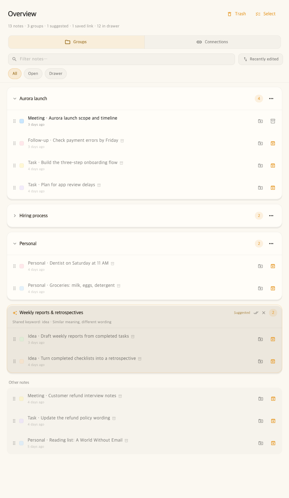

**English | [한국어](README.ko.md)**

<div align="center">
  
  <h1>Noteez</h1>
  <p><strong>Write it down. Find the connection when you need it.</strong></p>
  <p>A local-first sticky-note workspace with on-device recommendations.</p>
  <p>
    
    
    
    
    <a href="https://github.com/hofe7/noteez/actions/workflows/ci.yml"></a>
  </p>
</div>

---

Noteez is a macOS menu bar app for capturing ideas, meeting notes, and to-dos as soon as they come up.

Start writing without choosing folders or tags. Noteez uses keywords, timestamps, note context, and optional on-device embeddings to suggest related notes and groups. Notes, keyword search, manual organization, and Markdown import/export work without an AI model.



> This documentation preview renders the actual UI with English sample notes and translated labels. **The released app currently has a Korean UI.**

## Download · early beta

**[Download Noteez 0.0.1 for macOS (.dmg)](https://github.com/hofe7/noteez/releases/download/v0.0.1/Noteez-0.0.1.dmg)**

Universal build for Apple Silicon and Intel. This is an early beta with a Korean UI. It is ad-hoc signed, without Apple Developer ID signing or notarization, so macOS may require manual approval on first launch.

1. Open the DMG and drag Noteez into Applications.
2. Open Noteez. If macOS blocks it, go to **System Settings → Privacy & Security → Open Anyway**.
3. Look for the Noteez icon in the menu bar. Press **⌘⇧N** to create a note or **⌘⇧G** to open the overview.

See the [release notes](https://github.com/hofe7/noteez/releases/tag/v0.0.1) for installation details and testing limits. Report problems and feedback in [Issues](https://github.com/hofe7/noteez/issues), using fictional examples rather than personal notes, databases, or backups.

## Why Noteez?

Many note apps ask you to build a structure before you can organize your information. Noteez starts with capture.

- **Capture first.** Write from the menu bar or a global shortcut, then return to your work.
- **Organization is optional.** Recommendations explain why notes may belong together. You decide what to keep.
- **Useful without a model.** Keyword, time, and note-context signals provide recommendations on their own.
- **Your notes stay on your Mac.** No account, Noteez server, or note uploads.
- **Take your work with you.** Export notes and images as Markdown, along with links and manual groups.

## Features

### Quick, comfortable sticky notes

- Multiple independent macOS note windows
- Text, checklists, and local image blocks
- Colors, always-on-top, folding, drawer storage, and reminders
- Content-aware height expansion and restoration of window size and position
- Structured checklist data that preserves completion timestamps

### Search and related notes

- Keyword search and date-expression search
- Separate recent notes and semantically related results
- Hybrid recommendations using keywords, timestamps, note context, and optional embeddings
- Explanations, dismissible suggestions, and reevaluation after edits
- Expand a related-note suggestion to inspect its content and reasoning, then open it
- Keep useful suggestions as saved reference links, and remove them when no longer needed
- Saved links and imported links remain independent of group membership

### Suggested and manual groups

Switch between **Groups** and **Connections** in the overview. Groups show your named groups, suggested groups, and other notes. Connections show saved reference links and related-note suggestions as pairs, with actions to open, keep, remove, or dismiss them.

Pair suggestions exclude existing links and notes already in the same manual group. Linking notes does not merge them into a group or prevent future group suggestions.

- Suggested groups and titles based on related notes
- Strongly related notes form a core; additional candidates must fit without being easily confused with other groups
- Turn a suggested group into a named manual group
- Suggestions for adding notes to existing groups, with explanations and undo
- Persistent dismissal of suggestions for a particular group, with an option to restore them
- Direct organization through selection, drag-and-drop, and per-note move menus
- Undo group creation, moves, renaming, and deletion
- Deleting a group preserves its notes and links

### Connect and organize notes yourself

- Open the organization window from the **Connections / Groups** action below a note.
- Search other notes by title or content to add or remove reference links.
- Move a note into an existing group, remove it from a group, or start a new group with one note.
- Select multiple notes in the overview to group or move them together.
- Undo the last organization change. Moving notes between groups preserves their reference links. Manual organization does not require an AI model.

### Reuse your notes

- A completed-work report based on checked tasks and a selected time period
- Import Markdown files and folders
- Restore Obsidian wiki links and relative Markdown links
- Import Notion **Markdown & CSV export ZIPs** directly
- Export notes, images, links, and manual groups as Markdown
- Handle duplicates, updates, and conflicts when importing the same source again
- Back up and restore the database and attached images in a portable ZIP
- Automatic backups at startup and before external data imports, retaining the latest 10
- Inspect backup dates, sizes, and note counts before restoring

## Shortcuts

Noteez lives in the menu bar rather than the Dock.

| Action | Shortcut |
| --- | --- |
| New note | ⌘⇧N |
| Quick capture | ⌘⇧Space |
| Search | ⌘⇧K |
| Overview | ⌘⇧G |
| Completed-work report | ⌘⇧R |
| Show all sticky notes | ⌘⇧S |
| Fold / unfold current note | ⌘. |

## Privacy and local AI

Notes, links, and embeddings are stored in an app-specific SQLite database on your Mac. Attached images are stored locally in the app's storage. Search and recommendations run locally too.

Embedding models are optional and are not bundled with the app. When you choose a model, Noteez downloads it directly from its publisher's Hugging Face repository.

- Pinned repository revisions
- Download size and SHA-256 verification
- Installation only after file verification succeeds
- No download or execution of remote Python code or `custom_code`
- No note content in model download requests
- Core features and keyword recommendations continue if a model is unavailable or fails

The validated options are Multilingual E5 Small and Base, which support 94 languages, including Korean. Model language support is separate from the app's UI language. Compatible community models can also be searched, but installation requires validation of their ONNX structure, input format, license, pinned commit, and file hashes.

See [third-party licenses](THIRD_PARTY_LICENSES.md) for sources and licensing details. Local storage does not imply app-level encryption or protection from other software running with the same user permissions; see [Security](SECURITY.md).

## Build from source

Requirements:

- macOS 10.15 or later
- Flutter SDK with Dart 3.11 or later (CI uses Flutter 3.41.7)
- Xcode and the macOS development tools

```bash
git clone https://github.com/hofe7/noteez.git
cd noteez
flutter pub get
flutter run -d macos
```

Build a release app:

```bash
flutter build macos --release
```

Output: `build/macos/Build/Products/Release/noteez.app`.

Create a DMG:

```bash
./tool/make_dmg.sh
```

Output: `dist/Noteez.dmg`. These builds are ad-hoc signed and not Apple-notarized. The same first-launch approval described above may be needed on another Mac.

### GitHub releases

Regular pushes and pull requests run static analysis and the full test suite on Linux. Pull requests affecting core macOS code or plugins, and scheduled weekly runs, also validate a macOS release build.

For a new release, update `pubspec.yaml`, merge it into `main`, and push a matching version tag without the build suffix. For example, version `0.0.2+10` would use:

```bash
git tag -a v0.0.2 -m "Noteez 0.0.2"
git push origin v0.0.2
```

The tag workflow reruns analysis and tests, builds an ad-hoc signed universal app, and publishes a DMG and SHA-256 checksum. A tag that does not match the app version is rejected. Developer ID signing and notarization are not yet included. The first public beta uses the locally verified build 9 DMG.

## Development

```bash
# Static analysis
flutter analyze

# Full test suite
flutter test

# Regenerate Drift database code
dart run build_runner build
```

Tests cover editor block conversion, checklist metadata, database migrations, model download validation, search, links, suggested groups, Markdown/Notion portability, and key UI flows. Live Hugging Face smoke tests require network access and are opt-in:

```bash
RUN_HF_LIVE_TESTS=1 flutter test test/huggingface_live_smoke_test.dart
```

### Architecture

```text
lib/
├── editor/          # Quill editing representation ↔ persistent blocks
├── embed/           # Tokenizers and ONNX Runtime inference
├── markdown/        # Markdown, Obsidian, and Notion portability
├── backup/          # SQLite snapshots, images, backup and restore
├── models/          # Notes and model catalog
├── reminder/        # Local reminders
├── services/        # Persistence and recommendation coordination
├── windows/         # Notes, search, overview, reports, and model UI
├── db/              # Drift/SQLite storage and migrations
├── main_controller.dart
├── connection_engine.dart
└── hybrid_relevance.dart
```

The main process owns database and model state. Individual note windows send changes through IPC. Persistent content uses text, task, and image `Block` models rather than the editor library's Delta representation. Overview recommendation computation runs in a separate isolate.

See [architecture notes](docs/architecture.md) for more detail. Supporting development documents are currently in Korean.

## Project principles

1. **Capture first.** No organization required before writing.
2. **Local first.** Access to your notes should not depend on a hosted service.
3. **Suggest, don't rearrange.** The app proposes; you decide.
4. **Useful without AI.** Models enhance the app rather than gate its core features.
5. **Portable by default.** Both imported and newly created notes should be exportable.
6. **Restraint is a feature.** Everyday comfort matters more than feature count.

## Current scope and limits

Noteez is a macOS-first project under active development.

- **Korean UI only** in the current release. The English screenshot is a translated documentation preview.
- Notion and Obsidian support is through import/export, not live synchronization.
- A full knowledge-graph editor or project management suite is outside the current scope.
- Builds require manual first-launch approval until Apple notarization is available.
- Intel Macs, the minimum supported OS, and some native input, paste, restart, and sleep/reminder flows still need detailed hardware testing. See the [release notes](https://github.com/hofe7/noteez/releases/tag/v0.0.1).

Recommendation evaluation uses fictional notes with separate development and validation data. False grouping has been reduced, but similarly worded notes about different activities can still be mixed. See the [recommendation evaluation](docs/relevance-evaluation.md) and [performance validation](docs/release-validation.md) for results and limits.

Long notes are embedded in paragraph chunks so that content near the end remains searchable. Unchanged chunks reuse cached embeddings; group recommendations use an aggregate vector. Periodic timed backups are not yet implemented.

Deleted notes can be restored or permanently deleted from **Overview → Trash**. Trashed notes are excluded from search and recommendations and are not automatically emptied. Restoring a note preserves its content and creation/modification times and returns it to the drawer; previous groups, links, and reminders are not restored. Permanent deletion removes the note from the current library, but does not erase existing backups or external/attached image files.

## Contributing

Bug reports, usability feedback, tests, documentation improvements, and small pull requests are welcome. See [CONTRIBUTING.md](CONTRIBUTING.md) for setup and PR guidance, [SECURITY.md](SECURITY.md) for private vulnerability reporting, and [CHANGELOG.md](CHANGELOG.md) for changes. These supporting documents are currently in Korean.

Before proposing a change, consider whether it makes capture slower, takes decisions away from the user, requires a model for a core flow, or weakens data portability and privacy boundaries. Run `flutter analyze` and `flutter test` for code changes. For larger features, open an issue describing the problem and intended user flow first.

## License

Noteez is available under the [MIT License](LICENSE). Optional models and bundled third-party components retain their respective licenses.
